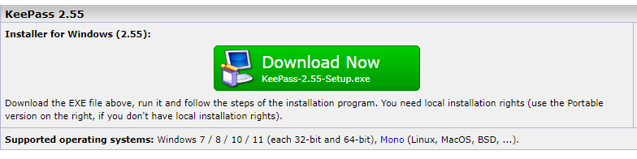

# Installation

## Table of contents

 - Installing Backup in google drive 
 - Installing Tailscale on Home Assistant
 - Installing docker
 - installing homeassistant with proxmox
 - installing EMQX 
 - installing Keepass

## Installing Backup in google drive

### Detailed Install Instructions
1. Navigate in your Home Assistant frontend to Settings -> Add-ons -> Add-on Store (Bottom Right).

2. Click the 3-dots menu at upper right ... > Repositories and add this repository's URL: https://github.com/sabeechen/hassio-google-drive-backup


3. Reload the page , scroll to the bottom to find the new repository, and click the new add-on named "Home Assistant Google Drive Backup":


Note: Home Assistant loads the repository in the background and the new item won't always show up automatically. You might need to wait a few seconds and then "hard refresh" the page for it to show up. On most browser the keyboard shortcut for this is CTRL+F5. If it still doesn't show up, clear your browser's cache and it should then.

4. Click Install and give it a few minutes to finish downloading.

5. Click Start, give it a few seconds to spin up, and then click the Open Web UI button that appears.

6. The "Getting Started" page will tell you how many backups you have and what it will do with them once you connect it to Google Drive. You can click Settings to change those options through the add-on (which is the recommended way, they take effect immediately), or update them from the page where you installed the add-on as described below (also works, restart for them to take effect).

7. Click the Authenticate with Drive button to link the add-on with your Google Drive account. Alternatively, you can generate your own Google API credentials, though the process is not simple.

8. You should be redirected automatically to the backup status page. Here you can make a new backups, see the progress of uploading to Google Drive, etc. You're done!


## Installing Tailscale on Home Assistant

### Installation

follow the link to a youtube video that explains what to do with tailscale

https://www.youtube.com/watch?v=okRHCU-FcgU&ab_channel=fixtSE 

### username

- username: pmvivesbrugge@gmail.com 


## Installing docker

### Installation

do
```
sudo apt install docker.io
```
to download docker in the terminal

<todo-add-container>

## Installing home assistant

### Installation

#### Create a Proxmox Bootable USB Drive

1. Download Balena Etcher and install it
2. Download the latest Proxmox VE ISO Installer and save it
3. Insert the USB drive in your PC
4. Open Balena Etcher and click Flash from file
5. Select the Proxmox ISO file you just downloaded
6. Click Select target and choose your USB Drive
7. Click Flash and wait for the process to finish
8. Depending on the speed of your USB Drive, the process should take ~2-5minutes
9. You will get a Flash complete! confirmation
10. Close Balena Etcher
11. Safely remove hardware (USB)
12. You are ready to install Proxmox

#### Set up Proxmox and HomeAssitant

1. Open your Proxmox instance by navigating to IP_Address:8006 from your main PC
2. You will get a warning message Your connection is not private
3. Click Advanced and click Proceed to IP_Address
4. On the Promox login screen login with the credentials:
– Username: root
– Password: password you set during installation
5. You will get a message saying you do not have a valid subscription
– This is showing up because you don’t have a valid enterprise license
– We will clean this up with a script too
6. Before we deploy Home Assistant, we need to update Proxmox packages
7. On the left side of the screen, select your VM and click Updates
8. Click Refresh and click Upgrade
9. A dialog window will popup, going through the available package updates
10. You may get another license warning, just ignore it
11. If you get a confirmation dialog, type in “y” and hit enter
12. If you get a dialog asking the Keyboard encoding select UTF-8 and English
13. You will get a your system is up to date message
14. Close the window and you are done
15. If you click Refresh again, the package list should disappear since you already updated them
16. To Install Home Assistant, we are going to use a script by tteck which will automate the process significantly
17. Running this script will:
– Find, download and extract the official KVM (qcow2) Home Assistant OS image
– Define user settings, import and attach disk, set boot order and start the VM automatically
– Install the VM with Default Settings: 4GB RAM, 32GB Storage and 2vCPU cores
– Settings can be tweaked during installation
18. Click your VM on the left and select Shell
19. Copy the following command to run the script and hit enter:
```
bash -c "$(wget -qLO - https://github.com/tteck/Proxmox/raw/main/vm/haos-vm.sh)"
```
20. The wizard will ask you to confirm that you want to create a Home Assistant OS VM
21. Select Yes and click confirm
22. On the next screen, choose either Default settings or Advanced
– Default settings are fine for a Home Assistant OS install, but you can assign more RAM and Storage if you need to

23. If you choose Advanced Settings, you will be prompted to choose:
– Home Assistant OS Version (Stable, Beta)
– Hostname (cannot contain underscore ‘_’)
– VM Machine ID
– Machine type
– Allocated CPU Cores
– Allocated RAM Memory
24. Select the final Yes to confirm
25. Wait for the script to download, extract and install the latest KVM image of HA OS
26. Once you get a Completed Successfully message, HA is installed
27. To see the IP address your router assigned to your Home Assistant VM instance, click your node on the left
28. Select your newly created Home Assistant VM
29. The IP address is displayed in the middle
– Use it to access Home Assistant in your web browser 192.168.xxx.xxx:8123
30. Finished, you’ve just install HA OS on Proxmox!


For photos and origninal content use this link [here](https://smarthomescene.com/guides/how-to-install-home-assistant-on-proxmox-the-easy-way/)


## EMQX

find on this page all there is to know about EMQX and how to set it up [here](.\EMQX.md).


## Keepass 

1. Go to https://keepass.info/download.html 
2. choose the most updated keepass version 
3. Choose the keepass 2 Version like show on the picture below

4. You are going to be send to a other page dont worry just wait 5 seconds and close the tab
5. open the .exe
6. choose your language
7. go through the rest of the installation steps
8. you have successfully installed keepass


For origninal content use this link [here](https://keepass.info/download.html)