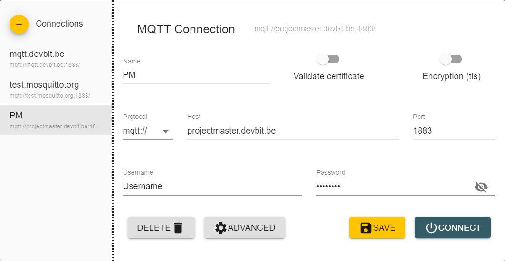

# STUDENTPROJECTS
In this readme students can check how the data from home assistant will be sent over the broker
## Table of contents
 - [Connection](#connection)
 - [Logins](#logins)
 - [Users](#users)
 - [Commands](#Commands)

## Connection
The MQTT broker is located on projectmaster.devbit.be

You can use a program like MQTT Explorer for troubleshouting




## Logins
### Info
People will get a username and password in accordance to their project. In general the username will be the name of the project and the password will be unique for every device.

Example (Not a real project): 
    The project vives has the username vives on all their devices and every device has a unique password.

**Never share your password with anyone but your own team or the admins of PM**

## Users
Every student only has acces to their own projects' respective topics
### Info
In genereal the topics of all projects will be according to the following:
```json
PM/"project_naam"/"device_naam"
```
In this example project_name is the name of the project to which the device belongs and device_name is the name of the device itself.

## Commands

### Commands

The following topics are available. However which of these exactly need implementation will have to be told to the admins of Project Master because this has to be assigned uppon device creation.
the topics are devided into two kinds. The ones that are available for every project. and the ones added upon device creation.

#### Universal topics
the command topic says whether a device should turn"ON" or "OFF"
```json
PM/project/command
```
De waarde in deze topic is ON or OFF as a string
#### Optional topics

- color topic: control color and brightness of a LED or other colored light


    ```json
    PM/project/device/"color_format
    ```
    the following color_formats are supported
    - hs (Hue and saturation)
    - rgb (Red Green Blue)
    - rgbw (Red Green Blue White)
    - rgbww (Red Green Blue Cold_White Warm_White)

    The data is sent on the topic as a string with the variables listed above (in said order) seperated by a comma.

    For example rgb would be sent as

    ```string
    red,green,blue
    ```

- effect topic: select a specific effect (mostly from an array)
    
    The students should give the admins a list of all the effects they wish to add

    sends effectname back as string under the following topic
    ```json
    PM/project/device/effect
    ```

- Other
    
    if projects want to use the broker for their own internal communication they can as long as they dont use any of the topics mentioned above and remain inside the correct project topic.
    