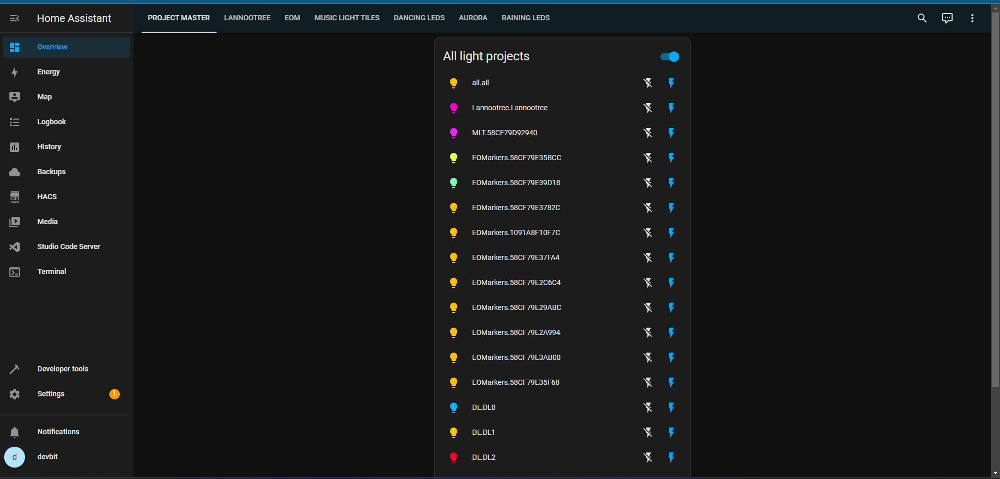
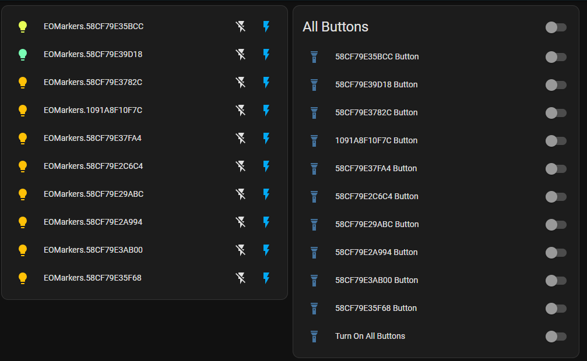
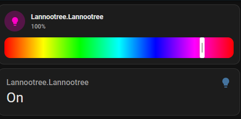
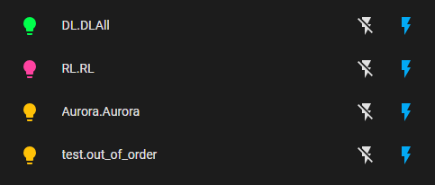
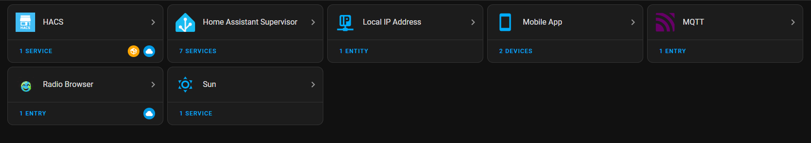
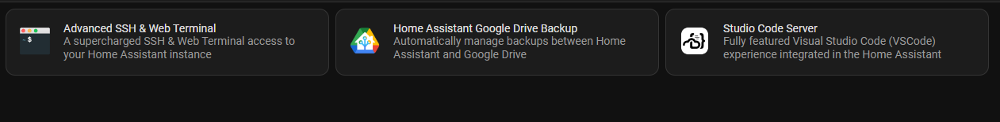

# Home Assistant 

## Table of Contents

- [Explanation Script](#explanation-script)
  - [Automation](#automation)
  - [Key Components](#key-components)
- [Code Configuration Script](#code-configuration-script)
- [Home Assistant Dashboard](#home-assistant-dashboard)
  - [Main Dashboard](#main-dashboard)
  - [Project Dashboard](#project-dashboard)
  - [All Projects Overview](#all-projects-overview)
  - [Integrations and Services](#integrations-and-services)
  
## Explanation script

### Automation:

- **Turn On All Buttons:**
  - An automation triggered by the state change of the `input_boolean.turn_on_all_buttons` entity to "on."
  - It publishes MQTT messages to visualize certain markers, then introduces a delay of 10 seconds before turning off the `input_boolean.turn_on_all_buttons`.
  
- **Zigbee2MQTT Switch1 Action Listener:**
  - Listens for MQTT messages on the topic "zigbee2mqtt/Switch1/action" and logs the payload to the Home Assistant logbook.
  
- **Zigbee2MQTT Switch2 Action Listener:**
  - Listens for MQTT messages on the topic "zigbee2mqtt/Switch2/action" and logs the payload to the Home Assistant logbook.

### Key Components

- **MQTT:** The code extensively uses MQTT for communication. 
  
- **Zigbee2MQTT:** There are two automations listening for actions from Zigbee2MQTT devices.

- **Visualization with MQTT:** The "Turn On All Buttons" automation triggers MQTT messages to visualize markers associated with specific topics.
  
- **Home Assistant Logbook:** The `logbook.log` service is used to log information about Zigbee2MQTT switch actions.


## configuration script

### configuration.yaml
```yaml
default_config:

frontend:
  themes: !include_dir_merge_named themes

script: !include scripts.yaml
scene: !include scenes.yaml


input_boolean:
  58cf79e35bcc_button:
    name: "58CF79E35BCC Button"
    initial: off
    icon: mdi:flashlight

  58cf79e39d18_button:
    name: "58CF79E39D18 Button"
    initial: off
    icon: mdi:flashlight

  58cf79e3782c_button:
    name: "58CF79E3782C Button"
    initial: off
    icon: mdi:flashlight

  1091a8f10f7c_button:
    name: "1091A8F10F7C Button"
    initial: off
    icon: mdi:flashlight

  58cf79e37fa4_button:
    name: "58CF79E37FA4 Button"
    initial: off
    icon: mdi:flashlight

  58cf79e2c6c4_button:
    name: "58CF79E2C6C4 Button"
    initial: off
    icon: mdi:flashlight

  58cf79e29abc_button:
    name: "58CF79E29ABC Button"
    initial: off
    icon: mdi:flashlight

  58cf79e2a994_button:
    name: "58CF79E2A994 Button"
    initial: off
    icon: mdi:flashlight

  58cf79e3ab00_button:
    name: "58CF79E3AB00 Button"
    initial: off
    icon: mdi:flashlight

  58cf79e35f68_button:
    name: "58CF79E35F68 Button"
    initial: off
    icon: mdi:flashlight

  turn_on_all_buttons:
    name: "Turn On All Buttons"
    initial: off
    icon: mdi:flashlight

automation:
  - id: turn_on_all_buttons
    alias: Turn On All Buttons
    trigger:
      platform: state
      entity_id: input_boolean.turn_on_all_buttons
      to: "on"
    action:
      - service: mqtt.publish
        data:
          topic: "PM/EOMarkers/58CF79E35BCC/visualize"
          payload: "true"
      - service: mqtt.publish
        data:
          topic: "PM/EOMarkers/58CF79E39D18/visualize"
          payload: "true"
      - service: mqtt.publish
        data:
          topic: "PM/EOMarkers/58CF79E3782C/visualize"
          payload: "true"
      - service: mqtt.publish
        data:
          topic: "PM/EOMarkers/1091A8F10F7C/visualize"
          payload: "true"
      - service: mqtt.publish
        data:
          topic: "PM/EOMarkers/58CF79E37FA4/visualize"
          payload: "true"
      - service: mqtt.publish
        data:
          topic: "PM/EOMarkers/58CF79E2C6C4/visualize"
          payload: "true"
      - service: mqtt.publish
        data:
          topic: "PM/EOMarkers/58CF79E29ABC/visualize"
          payload: "true"
      - service: mqtt.publish
        data:
          topic: "PM/EOMarkers/58CF79E2A994/visualize"
          payload: "true"
      - service: mqtt.publish
        data:
          topic: "PM/EOMarkers/58CF79E3AB00/visualize"
          payload: "true"
      - service: mqtt.publish
        data:
          topic: "PM/EOMarkers/58CF79E35F68/visualize"
          payload: "true"
      - delay: "00:00:10"
      - service: input_boolean.turn_off
        entity_id: input_boolean.turn_on_all_buttons


  - alias: "Zigbee2MQTT Switch1 Action Listener"
    trigger:
      platform: mqtt
      topic: "zigbee2mqtt/Switch1/action"
    
    action:
      - service: logbook.log
        data:
          name: "Zigbee2MQTT Switch1 Action Payload"
          message: "Received payload: {{ trigger.payload }}"


  - alias: "Zigbee2MQTT Switch2 Action Listener"
    trigger:
      platform: mqtt
      topic: "zigbee2mqtt/Switch2/action"
    
    action:
      - service: logbook.log
        data:
          name: "Zigbee2MQTT Switch2 Action Payload"
          message: "Received payload: {{ trigger.payload }}"

```


# Home Assistant Dashboard

## Main Dashboard



Welcome to the Home Assistant main dashboard. This is your central hub for managing all your projects and devices.

## Project Dashboard

### Project 1



### Project 2



The individual project dashboards tailored to their specific needs.

## All Projects Overview




Effortlessly manage and monitor all your projects in one place. Devices are dynamically added and removed.

## Integrations and Services

### Services

- **HACS (Home Assistant Community Store):** For outside services.
- **Mobile App:** Control devices conveniently from your phone.
- **MQTT (Message Queuing Telemetry Transport):** Reliable communication protocol.



### Add-ons

- **Advanced SSH and Web Terminal:** Enhanced terminal capabilities.
- **Google Drive Backup for Home Assistant:** Securely backup your Home Assistant data.
- **VS Code Editor for Scripts:** Edit scripts with the powerful VS Code editor.




